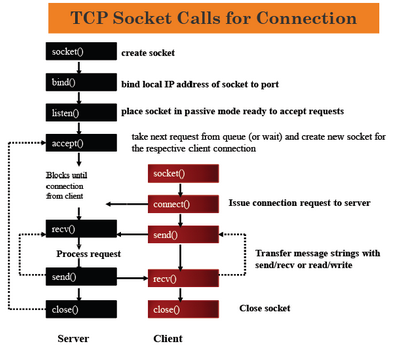
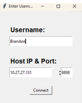
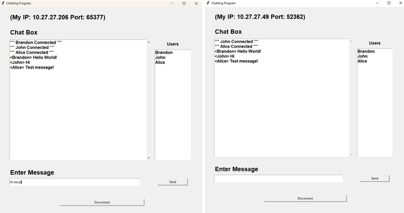
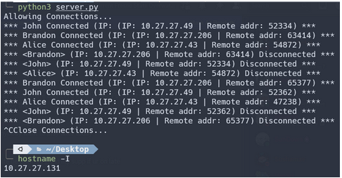

# Chat-Program

In my Computer Networks course, we had created a chat program which enable 2 or more users to communicate with each other and understand how TCP connections are utilized with the help of sockets to provide a reliable connection between the client and server. Threading is also involved in order to maintain multiple connections to the server.

The chat program consists of two files, client and server side script, both written in Python.

```bash
# Run the client side script
python3 client.py

# Run the server side script
python3 server.py
```

In order to connect, the user will provide a local IP address and a port number of the server. When the user/users are connected, they will be able to send messages by having the server receive the messages and rebroadcast them to the other connected clients. When a user wants to disconnect, they will send a message to the server indicating that they are going to exit the program and closes the socket connection. When the server is done accepting connections, it will close the socket.

<p align="center">
  
</p>

By Default, the server side script will open the socket connection numbered 9898. This can be changed in the script if you would like to use a different number.

## Graphical User Interface

The GUI on the client side utilizes TKinter. This ensures that the client will have a better experience rather than interacting with others through the terminal.

##### Linux users:

```bash
# Install pip and tkinter
python get-pip.py

pip install tk
```

##### Windows Users:

```powershell
# Install pip and tkinter
py get-pip.py

pip install tk
```

#### Username Prompt:

When first running the client script, the user will be prompted to give a username, server ip address and the port number it is trying to connect. The username will be displayed in the actual chat program when they connect to the server.

<p align="center">
  
</p>

#### Chat Box:

Once the client is connected, a chat box is displayed along with the users that are connected to the server. The user can freely communicate with the others but remember, it is broadcasted to everyone that is displaying in the "Users" text box.

<p align="center">
  
</p>

## Server Script:

The server does not have a GUI, instead everything is operated through the terminal. When running the program, the server shows that it is allowing connections and when a client connects to the server, it prints out the user name and their computer address information. The same goes when the user disconnects from the server.

<p align="center">
  
</p>

```bash
# Get the Server Local IP Address
hostname -I
```

## Notes:

This only used for internal network uses only. If you use Wireshark or any packet capture application, it will be able to detect what messages are being sent. So deploying this onto a server located outside the network may work, but it poses as a huge security risk.

Here is a more [detailed report](README_Resources/ChatProgramReport.pdf) on the project.

## Source/References

Links to some of the resources I used:

[Socket Programming](https://docs.python.org/3/howto/sockets.html) | [Tkinter](https://realpython.com/python-gui-tkinter/) | [Python Threading](https://realpython.com/intro-to-python-threading/)
